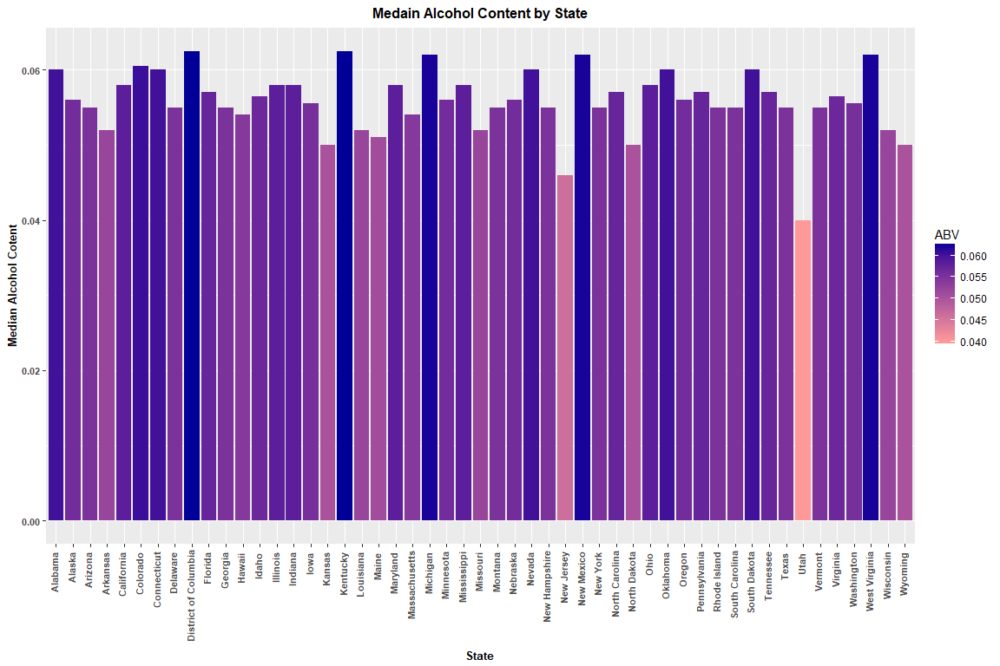
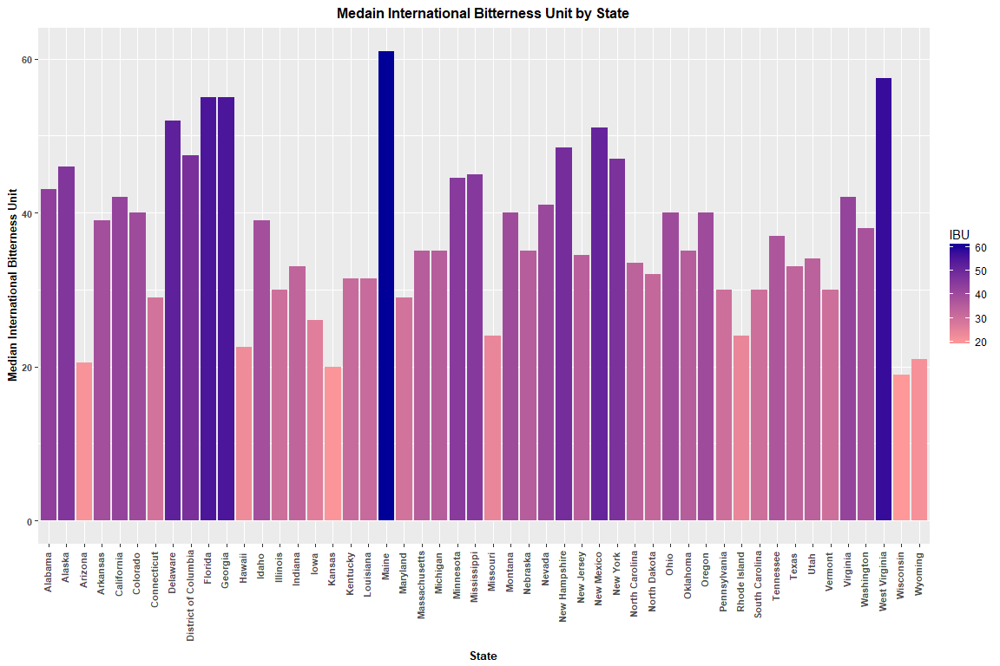
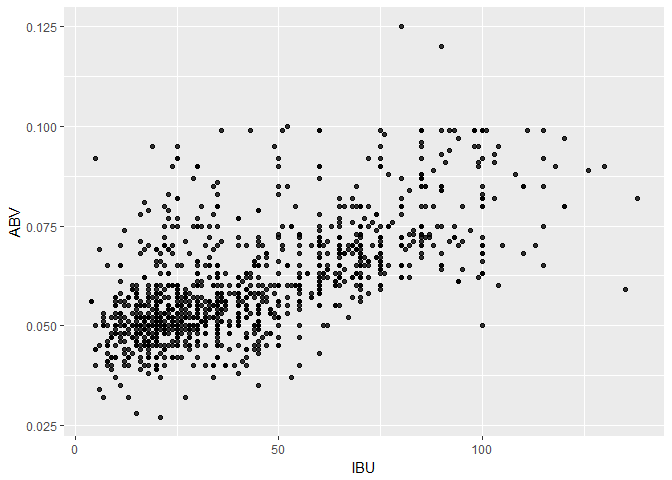

# CaseStudy01
Rangaswamy Nagarajan  
June 30, 2017  

## Beer

Beer is the world's oldest and most widely consumed alcoholic drink. It is the third most popular drink overall, after water and tea.<br />
This case study is about the analysis of data collected about Beers and Breweries in the United States of America. The data set contains a list of 2,410 US beers and 558 US breweries. 51 States are represented in the datasets.

Breweries dataset contains the list of all the breweries by City and Statewise in the USA.
It also contains the Name of the brewery and an ID for the brewery.

Beers dataset contains a list of beers available in USA.
The details that are avaialble in the dataset are Name, Beer ID, Brewery ID, Alcohol by Volume(ABV), International Bitterness Unit(IBU), Style and Ounces.
Based on the Brewery ID information we can tie the data back to the Brewery data and identify where a particular Beer was brewed.

A manually created StateNames.csv is also included as a dataset to represent state names instead of the codes in the output.
The dataset has 51 US state codes and names. This data is merged with the Brewery data based on the State_code data in StateNames.csv file and State in Breweries.csv file.<br />

####Common glossary terms used for the data sets.<br />
####Beers.csv:<br />
Name: Name of the beer.<br />
Beer ID: Unique identifier of the beer.<br />
ABV: Alcohol by volume of the beer.<br />
IBU: International Bitterness Units of the beer.<br />
Brewery ID: Brewery id associated with the beer.<br />
Style: Style of the beer.<br />
Ounces: Ounces of beer.

####Breweries.csv:<br />
Brew ID: Unique identifier of the brewery.<br />
Name: Name of the brewery.<br />
City: City where the brewery is located.<br />
State: State where the brewery is located.

####StateNames.csv:<br />
State_Code : Two letter code for the state.<br />
State_Name : State name.<br />


```r
knitr::opts_chunk$set(echo = TRUE)
library(ggplot2)
getwd()
setwd("C:/Users/swara/OneDrive/Documents/MSDS/Data Science/CaseStudy/MSDSCaseStudy01/Analysis")
```


```r
beers <- read.csv("C:/Users/swara/OneDrive/Documents/MSDS/Data Science/CaseStudy/MSDSCaseStudy01/Data/Beers.csv",header=TRUE)
breweries <- read.csv("C:/Users/swara/OneDrive/Documents/MSDS/Data Science/CaseStudy/MSDSCaseStudy01/Data/Breweries.csv", header=TRUE)
stateNames<-read.csv("C:/Users/swara/OneDrive/Documents/MSDS/Data Science/CaseStudy/MSDSCaseStudy01/Data/StateNames.csv",header=TRUE)

names(beers)[1] <- paste("Beer_Name")
names(breweries)[2] <- paste("Brewery_Name")

breweries$State <- trimws(breweries$State)
breweries<-merge(breweries, stateNames, by.x="State", by.y="State_Code", all=TRUE)
```


## Below is the number of breweries in each State.
<!-- Below code is used to identify the number of breweries in each state.-->

```r
NoOfBreweriesPerState <- data.frame(table(breweries$State_Name))
names(NoOfBreweriesPerState)[1]<-paste("State")
names(NoOfBreweriesPerState)[2]<-paste("Count")
NoOfBreweriesPerState
```

```
##                   State Count
## 1               Alabama     3
## 2                Alaska     7
## 3               Arizona    11
## 4              Arkansas     2
## 5            California    39
## 6              Colorado    47
## 7           Connecticut     8
## 8              Delaware     2
## 9  District of Columbia     1
## 10              Florida    15
## 11              Georgia     7
## 12               Hawaii     4
## 13                Idaho     5
## 14             Illinois    18
## 15              Indiana    22
## 16                 Iowa     5
## 17               Kansas     3
## 18             Kentucky     4
## 19            Louisiana     5
## 20                Maine     9
## 21             Maryland     7
## 22        Massachusetts    23
## 23             Michigan    32
## 24            Minnesota    12
## 25          Mississippi     2
## 26             Missouri     9
## 27              Montana     9
## 28             Nebraska     5
## 29               Nevada     2
## 30        New Hampshire     3
## 31           New Jersey     3
## 32           New Mexico     4
## 33             New York    16
## 34       North Carolina    19
## 35         North Dakota     1
## 36                 Ohio    15
## 37             Oklahoma     6
## 38               Oregon    29
## 39         Pennsylvania    25
## 40         Rhode Island     5
## 41       South Carolina     4
## 42         South Dakota     1
## 43            Tennessee     3
## 44                Texas    28
## 45                 Utah     4
## 46              Vermont    10
## 47             Virginia    16
## 48           Washington    23
## 49        West Virginia     1
## 50            Wisconsin    20
## 51              Wyoming     4
```

## Merged Beers and Breweries data.

```r
beerBrewery<-merge(breweries, beers, by.x="Brew_ID", by.y="Brewery_id", all=TRUE)
head(beerBrewery)
```

```
##   Brew_ID State       Brewery_Name        City State_Name     Beer_Name
## 1       1    MN NorthGate Brewing  Minneapolis  Minnesota Maggie's Leap
## 2       1    MN NorthGate Brewing  Minneapolis  Minnesota    Wall's End
## 3       1    MN NorthGate Brewing  Minneapolis  Minnesota  Get Together
## 4       1    MN NorthGate Brewing  Minneapolis  Minnesota   Parapet ESB
## 5       1    MN NorthGate Brewing  Minneapolis  Minnesota       Pumpion
## 6       1    MN NorthGate Brewing  Minneapolis  Minnesota    Stronghold
##   Beer_ID   ABV IBU                               Style Ounces
## 1    2691 0.049  26                  Milk / Sweet Stout     16
## 2    2690 0.048  19                   English Brown Ale     16
## 3    2692 0.045  50                        American IPA     16
## 4    2687 0.056  47 Extra Special / Strong Bitter (ESB)     16
## 5    2689 0.060  38                         Pumpkin Ale     16
## 6    2688 0.060  25                     American Porter     16
```

```r
tail(beerBrewery)
```

```
##      Brew_ID State                  Brewery_Name          City State_Name
## 2405     556    CA         Ukiah Brewing Company         Ukiah California
## 2406     557    NY       Butternuts Beer and Ale Garrattsville   New York
## 2407     557    NY       Butternuts Beer and Ale Garrattsville   New York
## 2408     557    NY       Butternuts Beer and Ale Garrattsville   New York
## 2409     557    NY       Butternuts Beer and Ale Garrattsville   New York
## 2410     558    AK Sleeping Lady Brewing Company     Anchorage     Alaska
##                      Beer_Name Beer_ID   ABV IBU                   Style
## 2405             Pilsner Ukiah      98 0.055  NA         German Pilsener
## 2406  Heinnieweisse Weissebier      52 0.049  NA              Hefeweizen
## 2407         Moo Thunder Stout      50 0.049  NA      Milk / Sweet Stout
## 2408         Porkslap Pale Ale      49 0.043  NA American Pale Ale (APA)
## 2409           Snapperhead IPA      51 0.068  NA            American IPA
## 2410 Urban Wilderness Pale Ale      30 0.049  NA        English Pale Ale
##      Ounces
## 2405     12
## 2406     12
## 2407     12
## 2408     12
## 2409     12
## 2410     12
```

## Below is the number of NA's in each column.
Only 3 columns have NA values.<br />
  1. ABV column has 62 NA's.<br />
  2. IBU column has 1005 NA's.<br />
  3. Style column has 5 NA's.<br />

<!--The below code is used to identify "" and replcae it with NA. There were 5 observations with style as "". the below code is used to replace "" with NA --> 


```r
beerBrewery$Style<-ifelse(beerBrewery[,10]=="", NA, beerBrewery[,10])
```
<!--The below code is used to count the number of NA is each column. -->

```r
na_count <-sapply(beerBrewery, function(y) sum(length(which(is.na(y)))))
na_count <- data.frame(na_count)
na_count
```

```
##              na_count
## Brew_ID             0
## State               0
## Brewery_Name        0
## City                0
## State_Name          0
## Beer_Name           0
## Beer_ID             0
## ABV                62
## IBU              1005
## Style               5
## Ounces              0
```


## Median alcohol content for each state.

```r
MedABVByState <- aggregate(ABV~State_Name, FUN = median, beerBrewery, na.rm = TRUE)
```

## Bar chart for median alcohol content by each state.


```r
ggplot(MedABVByState, aes(x=State_Name, y=ABV, fill=ABV))+
  geom_bar(stat="identity")+
  xlab("State")+
  ylab("Median Alcohol Cotent")+
  ggtitle("Medain Alcohol Content by State")+
  theme(plot.title = element_text(hjust = 0.5, size = 12, face="bold"))+
  theme(axis.text = element_text(size = 8, face="bold"))+
  theme(axis.text.x = element_text(angle = 90, vjust = 0.2, hjust=0.95, size = 8, face="bold"))+
  theme(axis.title = element_text(size = 10, face="bold"))+
  scale_fill_gradient(low="#FF9999",high="#000099")
```

<!-- -->


## Median international bitterness unit for each state.

```r
MedIBUByState <- aggregate(IBU~State_Name, FUN = median, beerBrewery, na.rm = TRUE)
```

## Bar chart for median international bitterness unit by each state.

```r
ggplot(MedIBUByState, aes(x=State_Name, y=IBU, fill=IBU))+
  geom_bar(stat="identity")+
  xlab("State")+
  ylab("Median International Bitterness Unit")+
  ggtitle("Medain International Bitterness Unit by State")+
  theme(plot.title = element_text(hjust = 0.5, size = 12, face="bold"))+
  theme(axis.text = element_text(size = 8, face="bold"))+
  theme(axis.text.x = element_text(angle = 90, vjust = 0.2, hjust=0.95, size = 8, face="bold"))+
  theme(axis.title = element_text(size = 10, face="bold"))+
  scale_fill_gradient(low="#FF9999",high="#000099")
```

<!-- -->
<!-- the codes for most alcoholic beer and most bitter beer works as following.-->
<!-- first the data is sorted in descending order based on ABV/IBU column.-->
<!-- the first observation is picked up using the head function, so now we have the observation that has the maximum value.-->
<!-- the oservation is assigned to a vector and the state is output from that vector.-->

## Colorado is the state that has the most alcoholic beer.

```r
maxAlcoholRow<-head(beerBrewery[order(-beerBrewery$ABV),],1)
maxAlcoholState<-as.character(maxAlcoholRow$State_Name)
maxAlcoholState
```

```
## [1] "Colorado"
```


## Oregon is the state that has the most bitter beer.

```r
maxBitterRow<-head(beerBrewery[order(-beerBrewery$IBU),],1)
maxBitterState<-as.character(maxBitterRow$State_Name)
maxBitterState
```

```
## [1] "Oregon"
```

## Summary statistics for ABV (Alcohol by volume) variable.

```r
summary(beerBrewery$ABV)
```

```
##    Min. 1st Qu.  Median    Mean 3rd Qu.    Max.    NA's 
## 0.00100 0.05000 0.05600 0.05977 0.06700 0.12800      62
```
The summary statistics show that the minimum ABV is 0.00100, median ABV is 0.05600 and mean ABV is 0.05977.<br />
The max ABV is 0.12800, which belongs to the state of Colorado that we identified in the previous question.<br />
There are also 62 NA's in the ABV data.

##  Scatter plot to identify relationship between the bitterness of the beer and its alcoholic content

```r
ggplot(data=na.omit(beerBrewery),aes(x=IBU,y=ABV))+geom_point(size=1.5,alpha=.8)
```

<!-- -->

Based on the scatter plot above there seems to be some relationship between the bitterness and alcohol content of the beer.
We can clearly see from the scatter plot that as the bitterness increases the alcohol content also increased, the plot shows a positive upward movement.

From the summary Statistics we found that the mean ABV value is 0.05600.
When we look at the scatter plot for ABV 0.05600, we can see that majority of the beer are around that spot and most of the beers around that spot are less bitter.

Colorado has the largest number  of breweries in the country. Colorado also has the most alocholic beer in the country.
The District of Columbia, North Dacota, South Dacota and West Virginia are the states with least number of breWeries.

Oregon has the most bitter beer in the country.
